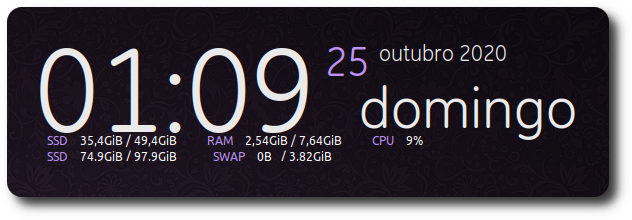
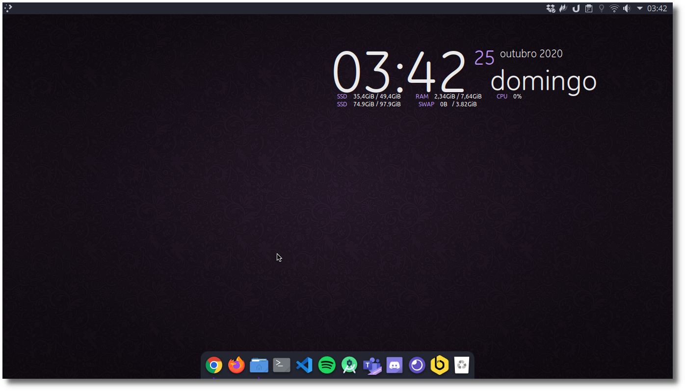

<h1 align="center">Conky :tv:</h1>

Pequenas modificações feitas para meu uso pessoal em meu Desktop. Obs: O projeto não foi criado por mim, para conhecer o projeto procure por <a href="https://github.com/Brunomello-xD/conky_settings#conhe%C3%A7a-o-conky">"Conheça o Conky".
</a>

   
  

Informações úteis
=================

**SSD**
* **SSD / (raiz)** - `Espaço livre / Total espaço`  
* **SSD /home (home)** - `Espaço livre / Total espaço`

**MEMÓRIA RAM**
* **RAM** - `Memória em uso / Total de memória`

**MEMÓRIA VIRTUAL**
* **SWAP** - `Memória em uso / Total de memória`

**PROCESSADOR**
* **CPU** - `Uso total`

Conheça o Conky
=================

* <a href="https://github.com/brndnmtthws/conky">GitHub Conky</a>
* <a href="https://github.com/brndnmtthws/conky/wiki">GitHub Wiki</a>

Licença
=================

Conky é licenciado sob os termos da licença <a href="https://github.com/brndnmtthws/conky/blob/master/LICENSE">GPLv3.</a>

Feito com :purple_heart:	 por [Bruno Mello.](https://www.linkedin.com/in/bruno-mello-14058819b/?lipi=urn%3Ali%3Apage%3Ad_flagship3_feed%3BIBMlTz6fSoaFIdcA5Dyn0Q%3D%3D&licu=urn%3Ali%3Acontrol%3Ad_flagship3_feed-nav.settings_view_profile)	:eyes:

